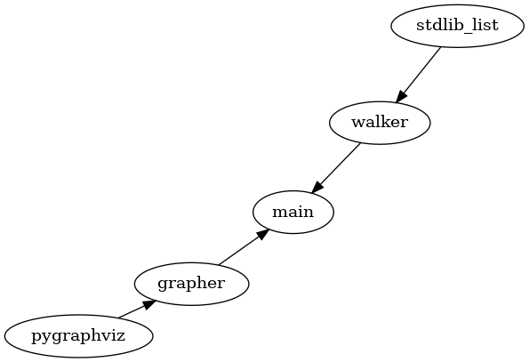
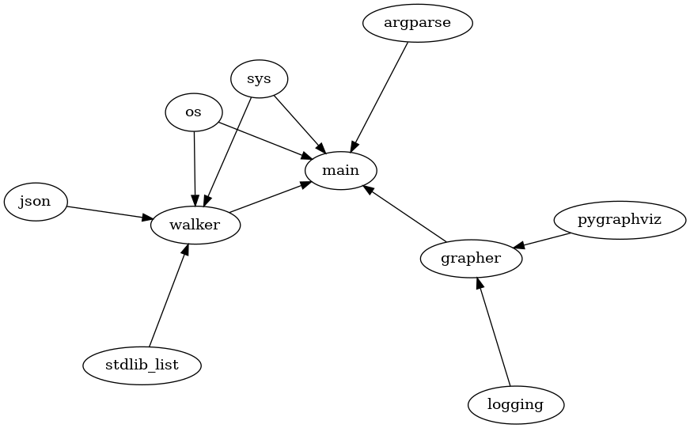
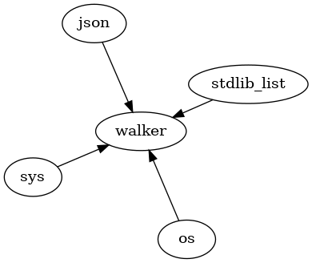
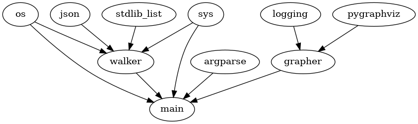

# Import Grapher

A simple python module to plot graph for module imports of a python project or a file.

## Requirements to run
- [Graphviz](https://graphviz.org/download/) installed on your system.
- Install modules from requirements.txt, `pip3 install -r reqirements.txt`

## How to use it?
- Basic usage:
  - `python3 main.py path_to_file_or_dir`

> Note: 
> - Path can be either directory or an individual file.
> - Graph does not include these folders: venv, \_\_pycache\_\_, .git, .vscode and .idea

- Flags:
  - Image
    - `-i/--image image_path`: provide path to store image.
    - Default image name: `graph.png`
    - Example: `python3 main.py path_to_file_or_dir -i out.jpg`
  - Layout
    - `-l/--layout [neato|dot|twopi|circo|fdp|nop]`: Describes graph layout.
    - Default: `neato`
    - Example: `python3 main.py path_to_file_or_dir -l fdp`
  - JSON
    - `-j/--json json_path`: provide path to store json data.
    - Default: No json file is stored.
    - Example: `python3 main.py path_to_file_or_dir -j data.json`
  - Standard Library
    - `-std-lib`: Include standard (built-in python) libraries in graph.
  - Help
    - `-h/--help`: Display help

> Note: By default **standard libraries are not included** in graph

## Screenshots
- Default graph for this project: `python3 main.py ../import-grapher`  

- Graph for this project with standard libraries: `python3 main.py ../import-grapher -std-lib`  

- Graph with standard library for [walker.py](./walker.py): `python3 main.py ./walker.py -std-lib`  

- Graph for this project with standard library in dot layout: `python3 main.py ../import-grapher -std-lib -l dot`  

